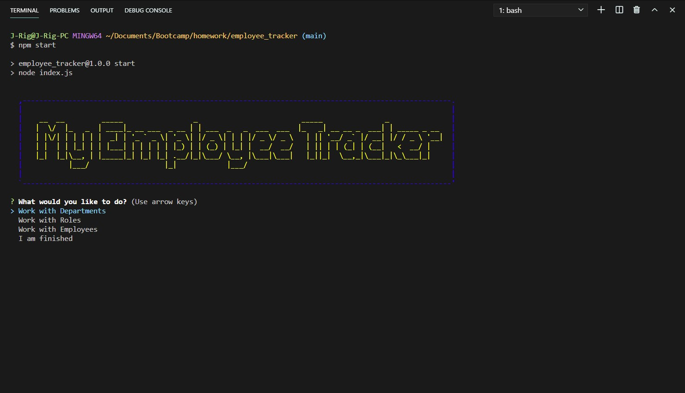

# Employee Tracker

  []

  A terminal app built to help businesses keep track of Employees/Roles/Departments.

  ## Table of Contents
  * [Installation](#Installation)
  * [Usage](#Usage)
  * [License](#License)
  * [Contributing](#Contributing)
  * [Tests](#Tests)
  * [Questions](#Questions)

## Installation

Please follow these steps to ensure a proper installation. 
Fork Repo, then 'run' NPM INSTALL.

## Usage

The following will outline the steps needed to use this project.  
Update the creds.js file with your own mysql password. Then you can start this by using either NPM Start, or Node index.js in a terminalcommand. Then Simply follow the on screen prompts.

## License
The MIT License

Please follow the link to learn more about the License this project is protected under. 
[https://opensource.org/licenses/MIT](https://opensource.org/licenses/MIT)

## Contributing

How can you contribute? 
Feel free to contact me with any suggestions that may help the app run smooth. 

## Tests

The following test steps can be taken to ensure the project is running correctly. 
Using the application, if you run into an error the Error will display in your terminal.

## Questions

Please contact me with any questions about this project. 

My GitHub URL is [https://github.com/jmalm79](https://github.com/jmalm79)

Email: jmalm79@gmail.com

Walkthrough Video#1 URL is [https://drive.google.com/file/d/1rFR4mMQ0cwdfjxekVBRKRi_LipqQtsNf/view](https://drive.google.com/file/d/1rFR4mMQ0cwdfjxekVBRKRi_LipqQtsNf/view)

